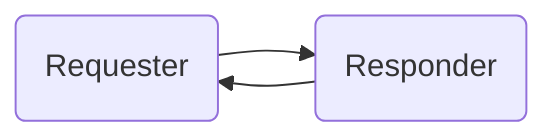

# Protocol

Protobuf protocol and communication specification of the BFH roboticsLab.  
(C) BFH, roboticsLab

### Table of Contents

- [Communication Architecture](#architecture)
- [Software Requirements](#requirements)
- [Proto Files](#proto-files)
- [TCP/IP Ports](#tcpip-ports)
- [Using as git Submodule](#git-submodule)

# <a name="architecture"></a>Communication Architecture

Communication between software modules happens by sending messages encoded using
[protocol buffers](https://developers.google.com/protocol-buffers/) (protobuf for short).
The messages are defined using the
[proto3](https://developers.google.com/protocol-buffers/docs/proto3) language.
The `protoc` compiler generates code in different programming languages for (de)serializing the messages.

Inter-module communication may happen with two different models:

1. **Request** — **Respond** (REQ — REP)



- The server is called _Responder_. The client is called _Requester_.
- A _Responder_ listens to *request*s.
- A _Requester_ sends a _request_ to a _Responder_.
- For each _request_ the _Responder_ will send a _response_.
- A second _request_ from the same _Requester_ may only be sent after reception of the first _response_, since the communication channel remains blocked.
- A _Responder_ can accept and process simultaneous _requests_ from many *Requester*s.

2. **Publish** — **Subscribe** (PUB — SUB)


- The server is called _Publisher_. The client is called _Subscriber_.
- A _Subscriber_ _subscribes_ to a _Publisher_.
- The _Publisher_ will _publish_ (broadcast) new messages whenever it has information to propagate.
- A _Publisher_ can accept simultaneous _subscriptions_ from many _Subscribers_.

These services are defined using [gRPC](https://grpc.io/docs/guides/concepts/), a protobuf extension.
The `protoc` compiler also generates client and server service code in
different programming languages.

Refer to the documentation of each proto file for details.

# <a name="requirements"></a>Software Requirements

The following software tools are required:

- gRPC (1.48 or higher)
- protobuf (3.19 or higher)

Depending on the programming language, the installation of these tools will differ. Below an example.

## Python 3

Assuming Python 3 is your default installation:

```bash
python -m pip install grpcio grpcio-tools
```

For details refer to: <https://grpc.io/docs/quickstart/python/>

# <a name="proto-files"></a>Proto Files

In this repository

- Directory `ch/bfh/roboticsLab` is the base directory.
- Directory `ch/bfh/roboticsLab/robot` contains protos specific for interfacing to robots.
- Directory `ch/bfh/roboticsLab/task` contains protos specific for programming and processing tasks for automation with robots.

## Design Notes

- The protobuf package names end in `.pb`. This way, the protobuf origin is
  directly visible in the generated namespace, package name, etc.
  Depending on the language, this also creates a neat syntax for
  accessing generated types, e.g. `pb::MyType` in C++.
- Different TCP ports are used depending on the the service offered,
  that is, each _Publisher_ and each _Responder_. This allows running multiple instances of a gRPC service on the same server.

# <a name="tcpip-ports"></a>TCP/IP Ports

Each application defines the services it wants to offer. These services shall be available on a TCP/IP port that is known to interested modules.

For roboticsLab implementations in an education setting (theory and practical courses, the following definition is used:
All _Publisher_ (PUB) and _Responder_ (REP) services for the roboticsLab have a designated IP port of the form `408xy`, where

- `x` is a single-digit code identifying a module
- `y` is a single-digit code identifying a service of a particular module

The `408` prepended to the port numbers is a play on the word `ROBot` with `4` for `R`, `0` for `O`, and `8` for `B`. This helps define port numbers high enough to be unique and non-reserved.

The table below lists all the attributed ports.

| Server             | Type | Port  | Protobuf file                                                           | Service                     | Message                |
| ------------------ | ---- | ----- | ----------------------------------------------------------------------- | --------------------------- | ---------------------- |
| Robot Control      | PUB  | 40811 | [robot/RobotControl.proto](ch/bfh/roboticsLab/robot/RobotControl.proto) | `robot.pb.Publisher`        | `robot.pb.Published`   |
| Robot Control      | REP  | 40812 | [robot/RobotControl.proto](ch/bfh/roboticsLab/robot/RobotControl.proto) | `robot.pb.Responder`        |                        |
| Robot Task Planner | PUB  | 40821 | [task/TaskList.proto](ch/bfh/roboticsLab/task/TaskList.proto)           | `task.pb.Publisher`         | `task.pb.Execution`    |
| Robot Task Planner | REP  | 40822 | [task/TaskList.proto](ch/bfh/roboticsLab/task/TaskList.proto)           | `task.pb.Responder`         |                        |
| Camera Server      | PUB  | 40831 | [vision/Vision.proto](ch/bfh/roboticsLab/vision/Vision.proto)           | `vision.pb.ImagePublisher`  | `vision.pb.Image`      |
| Vision             | PUB  | 40841 | [vision/Vision.proto](ch/bfh/roboticsLab/vision/Vision.proto)           | `vision.pb.ObjectPublisher` | `vision.pb.ObjectList` |
| Teach              | PUB  | 40851 | [task/Teach.proto](ch/bfh/roboticsLab/task/Teach.proto)                 | `task.teach.pb.Publisher`   |                        |
| Teach              | REP  | 40852 | [task/Teach.proto](ch/bfh/roboticsLab/task/Teach.proto)                 | `task.teach.pb.Responder`   |                        |

## Module Code Attribution

| Code (x) | Module                          |
| -------- | ------------------------------- |
| 0        | Reserved / System Configuration |
| 1        | Robot Control                   |
| 2        | Robot Task Planner              |
| 3        | Camera Server                   |
| 4        | Vision                          |
| 5        | Teach                           |

## Service Code Attribution

- Odd digits are used for publishers.
- Even digits are used for responders.

| Code (y) | Service     |
| -------- | ----------- |
| 0        | Reserved    |
| 1        | Publisher A |
| 2        | Responder A |
| 3        | Publisher B |
| 4        | Responder B |
| ...      | ...         |

# <a name="git-submodule"></a>Using as git Submodule
To use this repository as submodule for your project do:

```
git submodule add https://gitlab.ti.bfh.ch/roboticsLab/Protocol.git
```
